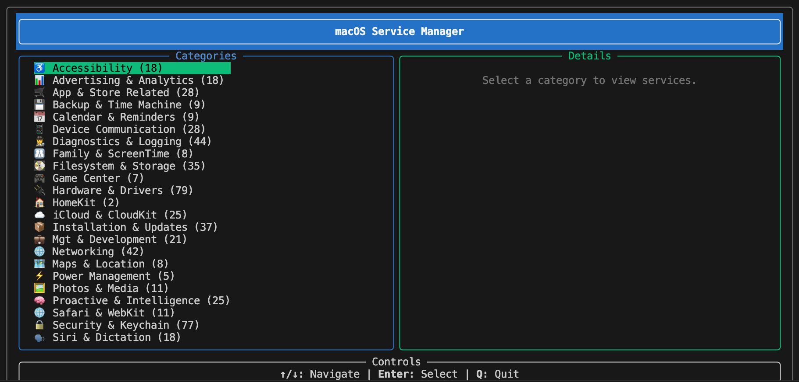
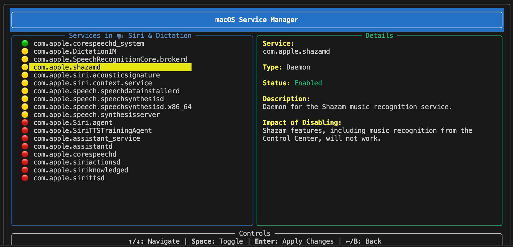
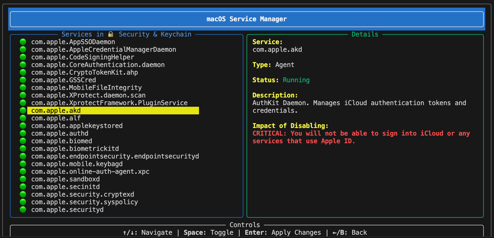

# macos-service-manager

## Description

This is a simple service manager for macOS that allows you to start, stop, and restart services. It is designed to be easy to use and provides a straightforward way to manage services on your macOS system.

## Screenshots

**Service categories**


**Running, Enabled, and Disabled Services**


**Service Details & Critical Services**


## Features

- Start, stop, and restart services
- List all available services
- Check the status of services
- User-friendly TUI (Text User Interface)

## Requirements

- Python 3.x

## Installation

1. Disable **SIP (System Integrity Protection)** on your macOS system. This is necessary to allow the script to manage system services. You can find instructions on how to disable SIP [here](https://support.apple.com/en-us/HT201560).
2. Clone the repository:

```bash
git clone https://github.com/bright-and-early/macos-service-manager.git
```

3. Navigate to the project directory:

```bash
cd macos-service-manager
```

4. Install the required dependencies:

```bash
pip install -r requirements.txt
```

5. Run the service manager:

```bash
sudo python3 manage-services.tui.py
```
